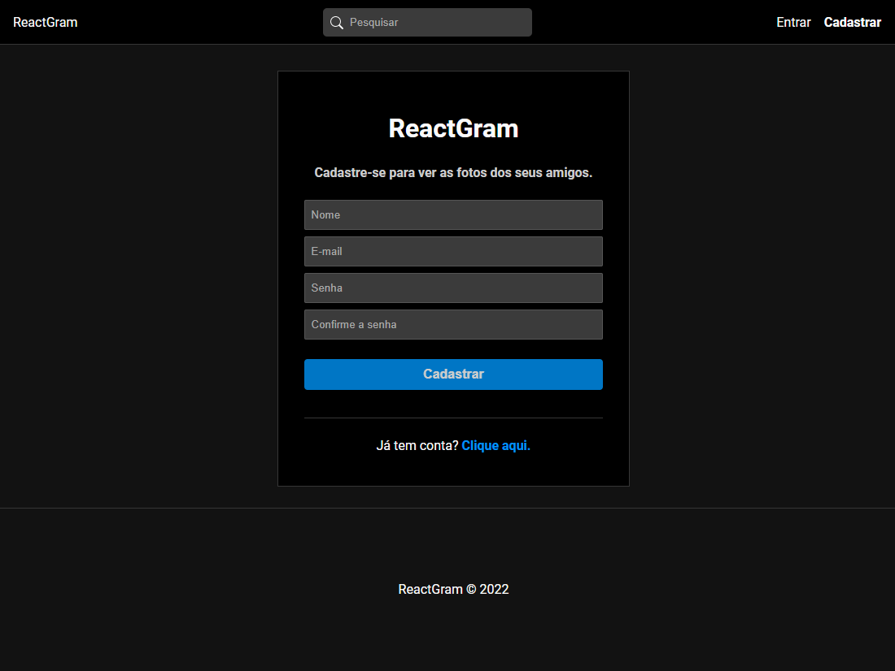
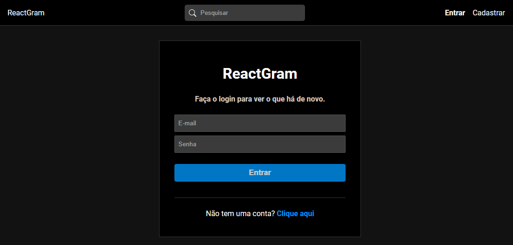
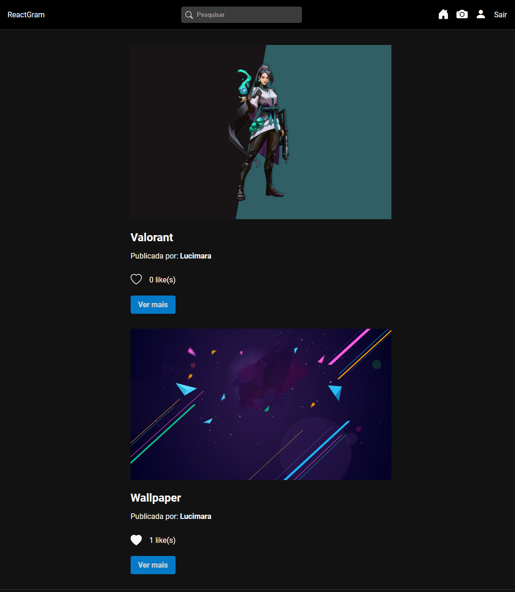
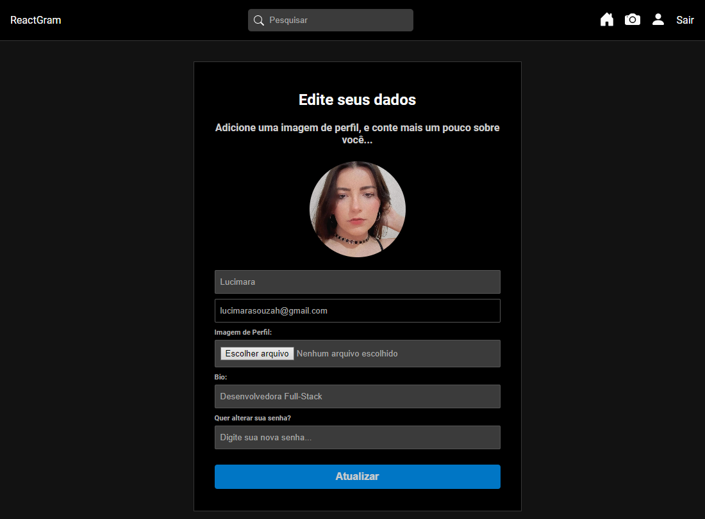
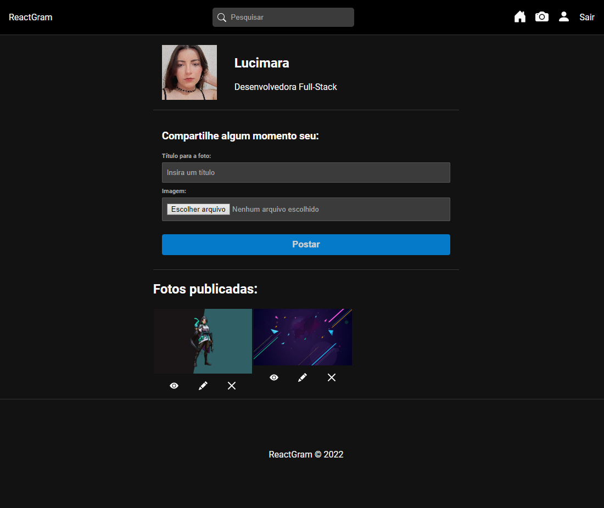

# ReactGram

<h4 align="center">
	
</h4>

<p align="center">
 <a href="#-sobre-o-projeto">Sobre</a> •
 <a href="#-layout">Layout</a> • 
 <a href="#-como-executar-o-projeto">Como executar</a> • 
 <a href="#-tecnologias">Tecnologias</a> • 
 <a href="#-como-contribuir-para-o-projeto">Contribuir com o projeto</a> • 
 <a href="#-agradecimentos">Agradecimentos</a>
</p>


## 💻 Sobre o projeto

Projeto desenvolvido no curso de ReactJS oferecido pelo Matheus Battisti. Consiste em um site capaz de realizar cadastro, login, publicar fotos, deixar comentário e like.

---

## 🎨 Layout











---


## 🚀 Como executar o projeto

#### 🧭 Rodando a aplicação web na sua máquina

```bash
# Clone este repositório
$ git clone https://github.com/LucimaraSouzah/reactGram
# Acesse a pasta do projeto no seu terminal/cmd
$ cd ReactGram
# Acesse a parte backend e baixe as dependências necessárias
$ cd backend/ 
$ npm install
# Para rodar o backend
$ npm run server
# Acesse a parte frontend e baixe as depêndencias necessárias
$ cd frontend/
$ npm install
# Para rodar o frontend 
$ npm start 
# Assim o projeto será executado na URL: 'http://localhost:3000'

```

## 🛠 Tecnologias

- **[ReactJS](https://reactjs.org)**
- **[Express](https://expressjs.com/pt-br/)**
- **[MongoDB](https://www.mongodb.com)**


#### **Utilitários**

- Editor:  **[Visual Studio Code](https://code.visualstudio.com/)**
- Testes API/Rest: **[Insomnia](https://insomnia.rest)**

---

## 💪 Como contribuir para o projeto

1. Faça um **fork** do projeto.
2. Crie uma nova branch com as suas alterações: `git checkout -b my-feature`
3. Salve as alterações e crie uma mensagem de commit contando o que você fez: `git commit -m "feature: My new feature"`
4. Envie as suas alterações: `git push origin my-feature`
> Caso tenha alguma dúvida confira este [guia de como contribuir no GitHub](./CONTRIBUTING.md)
---

## 📝 Agradecimentos

Obrigada pela atenção, espero que tenha gostado. Créditos: **[Matheus Battisti](https://github.com/matheusbattisti)**

Feito por Lucimara Souza 💜

---
© 2022 GitHub, Inc.
